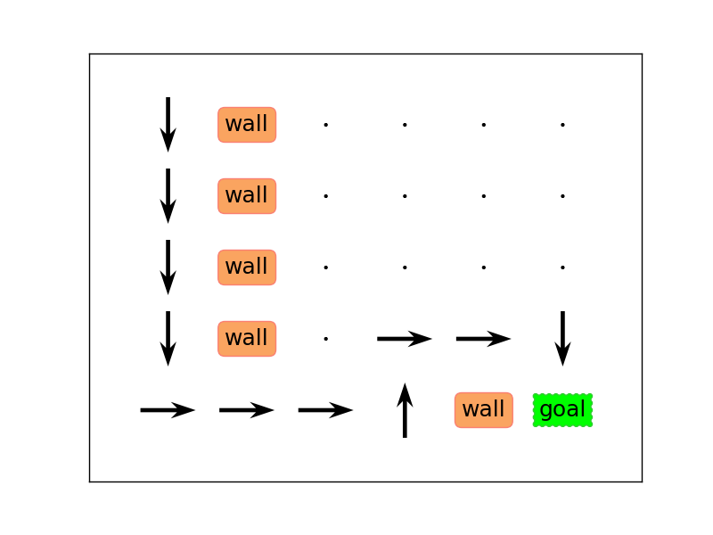

This project is largely inspired by the online course:
- Artificial Intelligence for Robotics: http://www.udacity.com/course/cs373

### 1) Localization

#### 1.a) Histogram Filter

Let's assume that we are in possession a map of the "world" as depicted on the left panel.  Our objective is to localize ourselves on this map.  

We can do this by assigning a probability to be in each cell as shown in the right panel.  In the absence of any information, our first guess is that we are equally likely to be anywhere in the world.  From then on, we can pinpoint our location more precisely by moving from cell to cell and using a sensor to measure the color of the cells as we go along.

Let's say for example that we are following the steps as in the animation (right, down, down, right).  In addition, we measure that we are in a green cell during all of our path.  Clearly, this will lead to a probability peak in the (row=3, col=4).  Note that the probability of being in this cell is only about 35% since we are accounting for the possibility of unsuccessful moves as well as sensor errors (same parameters as those discussed in the online lecture).  This makes this cell about 3 times more likely to be our location after all these moves and measurements compared to the second best possibility.

<p align="center">


</p>

You can run the demo with:
```
python HistogramFilter/localizerMotion.py
```

#### 1.b) Kalman Filter

We set up the state transition matrix to tackle a very simple situation in which an object is expected to move at a fixed (but unknown) velocity in the plane.  By using a series of measurements, the Kalman Filter allows us to very quickly make a good estimate about the velocity of the object which can then be used to predict its future position.  For example, the animation shows how after 3 measurements it is possbile to predict the position x, y and velocity vx (along the horizontal axis), vy (along the vertical axis).

<p align="center">

</p> 

You can run the demo with:
```
python KalmanFilter/kalmanFilter.py
```

#### 1.c) Particle Filter

You can run the demo with:
```
python ParticleFilter/runRobot.py
```

### 2) Search

#### 2.1) A* algorithm

We are using a simple Manhattan-like cost function (L1 norm).

<p align="center">

</p>

You can run the demo with:
```
python Search/aStar.py
```

#### 2.2) Dynamic Programming

Instead of trying to determine the shortest path from a precise starting location to the end location, we may need to know the optimal way to reach the end location from anywhere on the map.  Similarly to the A* algorithm example, we are using a simple cost function all possible displacements are penalized equally.

<p align="center">


</p>

You can run the demo with:
```
python Search/dynamicProgramming.py
```

#### 2.3) From the perspective of graphs using Neo4j  

All *StreetCorner* nodes are connected to each other via a *Connected* relationship that contains a *timeToNode* property which models the cost associated with driving along a specific relation.  Those properties (and how to construct the graph) are shown in the Cypher query: **Search/Neo4j/dataAndQuery.cypher**.  Running the query below will find the total cost of all directed paths starting at node "A" and ending at node "I" organized from best to worst (see **Search/Neo4j/paths_Neo4j.csv** for complete results).

```cypher
MATCH           path = (startNode:StreetCorner)-[:Connected*]->(endNode:StreetCorner)
WHERE           startNode.name="A" AND endNode.name="I"
RETURN          extract(node in nodes(path) | node.name) AS nameOfNodes,
                extract(relationship in relationships(path) | relationship.timeToNode) AS timeToNodes,
                length(path) AS lengthOfPath,
                reduce(accumulatedTime = 0, relationship in relationships(path) | accumulatedTime + relationship.timeToNode) AS totalWeight
ORDER BY        totalWeight ASC
```

<p align="center">

</p>

